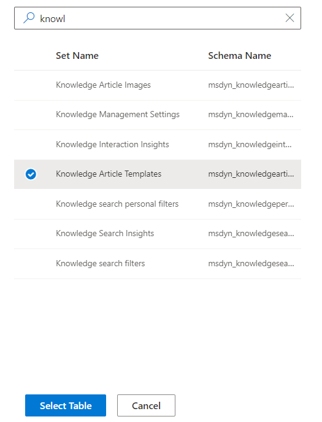

# PowerFX Plugins

This repo seeks to demonstrate a viable use of PowerFX as a low-code tool for authoring custom logic to execute in Dataverse Plugin Context. There are many business cases that requre plugin execution as opposed to low-code alternatives--such as the need to inject logic into unattended events--and this repo demonstrates an approach to using PowerFX to support those cases.

## Quick Note:

For anyone trying to check out this repo right now: There is an acknowledged bug in the latest public Nuget release for PowerFX, which causes mutation functions to improperly handle Record type objects. This is resolved in the PowerFX private nuget stream, so you MUST use the private stream to restore your nuget packages. Instructions for that private stream are found [here](https://github.com/microsoft/power-fx#daily-builds)

## Contents

This repo introduces 4 main elements for addressing this challenge:
- PCF control for selection of target table ( ./contextBuilder/ )
- Monaco Editor PCF for PowerFX Logic Authoring ( ./MonacoForPFX/ )
- Plugin Package for the Evaluation assembly ( ./pfxPlugin/ )
- PCF control for registering new steps on the plugin assembly ( ./registerPlugin/ )

## POC Design

The initial Proof of Concept will consist of a plugin package and <some> PCFs registered on a model driven app custom table. The table will store the PowerFX definitions for each custom rule to be implemented (event, context, code) and each row will (once published) correspond with a registered plugin step.

The first PCF will enable a user to pick a target table for registering the event. In time, this will also allow the user to view the table columns as PowerFX variables so the user can browse the variables while authoring the logic. The Monaco PFX control will then allow the user to add PFX logic, and the Plugin Package will evaluate that logic and take action. Initially, the only actions supported by the Plugin Package will be:

- To add to a plugin trace any direct output value from the PFX (non-behavior outputs)
- To check for any altered values (i.e. any columns that were edited with a Set() ) and issue commensurate changes to the table

The PFX Plugin will NOT initially support referencing other Dataverse tables/records (although this is a desired end state).

The register plugin PCF will allow the user to "publish" the pfx definition to a step.

## contextBuilder
The context builder allows the user to browse all tables in the current dataverse database (by setname or by schemaname) and select a table to register PowerFX on. The control is built on a Virtual PCF (fw=react) using only standard FluentUI elements.

## Monaco for JSON

This control is being dropped. The Context Object was determined easier to evaluate at runtime (given that actual input vars needed to be evaluated at that time anyway) so the predefinition and mutability of that definition are no longer needed. 

In the future, we might want to re-introduce a JSON control window for allowing UDFs and UDVs, but for now this is removed from scope.

## Monaco for PFX

This Monaco editor gives the user basic syntax coloring, but none of the server-side validation or autocompletion of the PowerFX code editor examples. Those features are excellent, but in a PowerApps context the requirement for running an ASP.net site dramatically complicates deployment *(yes,* __🙏@MikeStall🙏__ *I could have built this control based on the [PowerFX Samples](https://github.com/microsoft/power-fx-host-samples) but I would have lost a lot of folks who are PowerApps Only and don't speak Azure or custom web - even as it is all these PCFs are probably too much for folks that don't have pro dev support)* 🤯 The server-side piece of the sample code is pretty straightforward - maybe in a future project I'll try to implement that as a Custom API to keep it "dataverse friendly."

## pfxPlugin

Disclaimers: 
- The plugin execution currently only supports the context of the currently executing record. We're hoping in the future to support other records in the same table, then other dataverse tables, then (maybe someday!) other datasources, but for this immediate release, the context is very limited.
- The plugin package has only been written to support Update events so far. Create, Delete, and other event types are not yet supported.
- Mutation effects on Records are working, but has only been tested on "standard" column types (i.e. I haven't even tried to support multi-select optionsets ~~or polymorphic lookups~~ or attachment columns). *UPDATE:* Polymorphic columns are now added and tested using Customer type lookup
- The pfx Plugin was written on the latest PAC Plugin template, and uses the base class from that plugin template.
- This Plugin was written as a Plugin Package, since it requires external Nuget packages from the PFX team.
- The Plugin Package can ONLY be deployed as a package, and not as a freestanding Plugin Assembly, so if you aren't comfortable with managing assembly dependencies, I suggest you wait until the--let's call it "alpha" release--solution file is available 😁
- The Plugin dependencies referenced from core look at the PowerFX latest nuget stream. This means you will need to create your own Nuget reference from Visual Studio. The PowerFX Github README contains some instructions links for this if you're not sure how.

The pfxPlugin package can be registered using the Plugin Registration Tool from Microsoft's nuget stream (the XRM Toolbox plugin does not support registering Packages). Once registered, to associate PowerFX with an Update event, you must Register a new Step as Update, in the Pre-Validation Stage (only Pre-Validation can support updating ownerid and ownerid is not in the reserved set of columns), and on that Step you must register a Pre-Image containing all columns with the name "PreImage".

The Plugin assumes your environment includes a table "ktcs_plugincommand" with a string column "ktcs_command" where the Powerfx to execute is stored. To reference the correct row in the ktcs_plugincommand table, add the guid of the record to the Unsecure Config in the registered plugin step.
