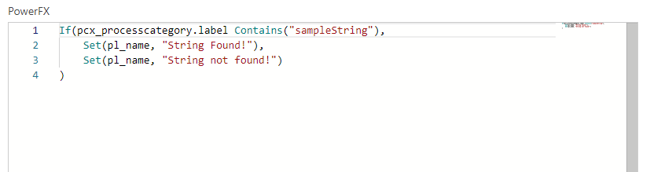

# PowerFX Plugins

This repo seeks to demonstrate a viable use of PowerFX as a low-code tool for authoring custom logic to execute in Dataverse Plugin Context. There are many business cases that requre plugin execution as opposed to low-code alternatives--such as the need to inject logic into unattended events--and this repo demonstrates an approach to using PowerFX to support those cases.

## Contents

This repo introduces 5 main elements for addressing this challenge:
- PowerFX Editor PCF for PowerFX Logic Authoring ( ./MonacoForPFX/ )
- A Monaco Editor PCF for JSON for Context Definition ( ./MonacoForJSON/ )
- A Plugin Package for the Evaluation assembly ( ./pfxPlugin/ )
- A PCF control for pre-populating the Context JSON based on user selection of target table ( ./contextBuilder/ )
- A PCF control for registering new steps on the plugin assembly ( ./registerPlugin/ )

## POC Design

The initial Proof of Concept will consist of a plugin package and four PCFs registered on a single form on a custom table. The table will store the PowerFX definitions for each custom rule to be implemented (event, context, code) and each row will (once published) correspond 1:1 with a registered plugin step.

when form type is Create the pre-populating PCF will enable a user to pick a target table and one "sample" row from that table to prepopulate the Context JSON. The Context JSON will then pull the table definition and build objects containing values for each column on the table.

Once populated, the Context JSON will be editable in the Monaco Editor PCF so that additional const params and sample values can be added, if appropriate.

The pfxPcf control will then allow the user to add PCF logic, and the Plugin Package will evaluate that logic and take action. Initially, the only actions supported by the Plugin Package will be:

- To add to a plugin trace any direct output value from the PFX
- To check the Context for any altered values (i.e. any context values that were edited with a Set() ) and issue commensurate changes to the table

The register plugin PCF will allow the user to "publish" the pfx definition to a step.

## contextBuilder
The context builder allows the user to browse all tables in the current dataverse database (by setname or by schemaname) and select a table to register PowerFX on. The control is built on a Virtual PCF (fw=react) using only standard FluentUI elements.


## Monaco for JSON

*This control should be merged with the Monaco for PFX control (so there is just one Monaco control that accept the lang as a parameter), but they are currently being left separate while working out bugs from the PFX Monarch definition*

The JSON monaco editor is used to present the JSON Context Object that is generated automatically by the contextBuilder. This generated JSON acts as a map for the PowerFX author, showing what table attributes can be accessed and "dot walked." For example, in the image below, this JSON tells the PowerFX writer that a valid variable is ```statecode```, and that the label value of that optionset can be accessed as ```statecode.label```


Eventually, it is intended that this control will also enable users to insert their own JSON objects to create constants, set references to other values, etc.

## Monaco for PFX

This Monaco editor gives the user basic syntax coloring, but none of the server-side validation of the PowerFX code editor examples. Those features are excellent, but in a PowerApps context the requirement for running an ASP.net site dramatically complicates deployment *(i.e. yes, I could have built this control based on the [PowerFX Samples](https://github.com/microsoft/power-fx-host-samples) but I would have lost a lot of folks who are PowerApps Only and don't speak Azure or custom web)*

